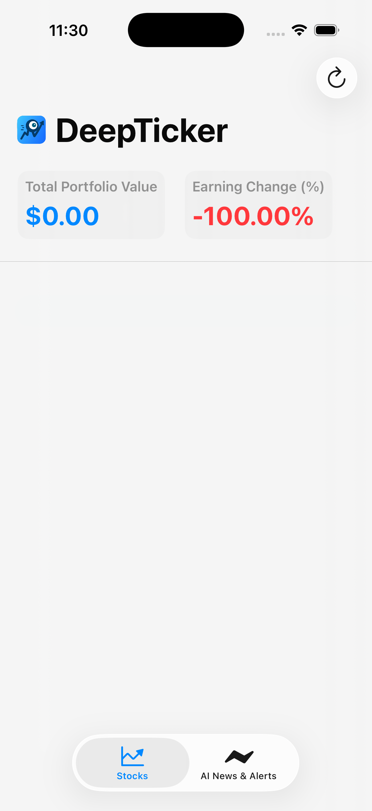

# DeepTicker

DeepTicker is a simple yet powerful stock portfolio tracking application built with SwiftUI for Apple platforms. It allows users to monitor the value of their stock holdings, track their earnings, and manage their portfolio with ease.

## 📸 Screenshots

*(It's highly recommended to add a screenshot or GIF of the app in action here to give a quick visual overview.)*



## ✨ Features

- **Portfolio at a Glance:** View your total portfolio value and overall percentage earnings change on the main screen.
- **Add Stocks Seamlessly:** Easily add new stocks to your portfolio. If you don't provide a purchase price, the app automatically fetches the current market price for you.
- **Edit & Delete Holdings:** Quickly modify the quantity and purchase price of your existing stocks, or swipe to delete them.
- **Manual Price Refresh:** Pull down to refresh all stock prices and get the latest valuation of your portfolio.
- **Modern & Responsive UI:** Built entirely with SwiftUI for a clean, modern, and adaptive user interface.
- **Asynchronous by Design:** Leverages Swift Concurrency (`async/await`) for smooth and responsive network requests that never block the UI.

## 🛠️ Technologies Used

- **UI Framework:** SwiftUI
- **Language:** Swift
- **Concurrency:** Swift Concurrency (`async/await`)
- **Data Fetching:** [Alpha Vantage API](https://www.alphavantage.co/) for stock price data

## 🚀 Getting Started

Follow these instructions to get the project up and running on your local machine.

### Prerequisites

- macOS with the latest version of Xcode installed.
- An active internet connection.

### Installation & Setup

The app uses the **Alpha Vantage API** to fetch stock data. You will need a free API key to run the project.

1.  **Get an API Key:** Go to [Alpha Vantage](https://www.alphavantage.co/support/#api-key) and claim your free API key.
2.  **Clone the Repository:**
    ```bash
    git clone [your-repository-url]
    cd DeepTicker
